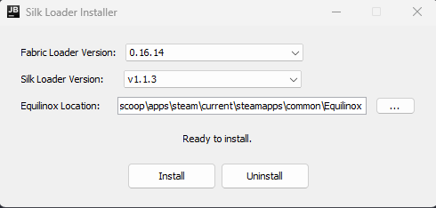

# Silk Loader Installer

A user-friendly graphical installer for [Silk Loader](https://github.com/SilkLoader/silk-loader), a mod loader for [Equilinox](https://www.equilinox.com/about/).



## Prerequisites

* **Java Runtime Environment (JRE):** Version 17 or newer is required to run the installer (`.jar` file). You can download Java from [Oracle](https://www.oracle.com/java/technologies/downloads/) or [Adoptium](https://adoptium.net/).
* **Equilinox:** A valid steam installation of Equilinox.
* **Internet Connection:** Required to download loader versions and libraries.

## How to Use

1.  **Download:** Get the latest installer jar from the [Releases](https://github.com/SilkLoader/silk-installer/releases/latest).
2.  **Run the Installer:**
    * Double-click the `.jar` file. If double-clicking doesn't work, ensure you have Java installed correctly and associated with .jar files. Otherwise, use the command line method below.
    * Open a terminal/command prompt, navigate to the directory where you downloaded the JAR, and run:
        ```bash
        java -jar [downloaded jar name].jar
        ```
3.  **Select Versions:**
    * The installer will automatically fetch the latest Fabric Loader and Silk Loader versions.
    * You can choose specific versions from the dropdown menus if needed.
4. **Locate Equilinox:**
    * The installer will attempt to find your Equilinox game directory.
    * If found, verify the path.
    * If not found, or if the path is incorrect, click the "..." (Browse) button to manually select your Equilinox installation directory.
    * **Note: If the game installation is not detected, try running Equilinox first so it
        can generate the `unlockList.dat` and `Equilinox_*_UserConfigs.dat` files.**
5.  **Install:**
    * Once versions are selected and the path is correct, click the "Install" button.
    * The installer will download and set up the files.
6.  **Steam Launch Options:**
    * After successful installation, a popup will appear with instructions on
      how to configure Equilinox to automatically launch with the silk loader.
7.  **Launch Equilinox:** Start Equilinox through Steam. Silk Loader should now be working.

## To Uninstall

1.  Run the Silk Loader Installer again.
2.  Ensure the Equilinox game path is correctly set.
3.  Click the "Uninstall" button.
4.  **Important:** After uninstallation, remember to remove the Steam launch options you set previously to ensure Equilinox launches normally.

## Troubleshooting

* **Installer doesn't launch when double-clicked:**
    * Ensure you have Java Runtime Environment (JRE) version 17 or newer installed. You can verify by opening a terminal/command prompt and typing `java -version`.
    * Make sure `.jar` files are associated with Java. You might need to reinstall Java or manually set the association.
    * As a fallback, always try running from the command line: `java -jar [downloaded jar name].jar`.

* **Equilinox game directory not found:**
    * Try running Equilinox at least once to generate necessary configuration files.
    * Use the "..." (Browse) button to manually navigate to and select your Equilinox installation directory (usually within your Steam library, e.g., `...\steamapps\common\Equilinox`).

* **Installation completes, but Silk Loader isn't working in-game:**
    * Double-check that you have correctly configured the Steam Launch Options for Equilinox as instructed by the installer.
    * Ensure there are no typos in the launch options.

## Building from Source

1.  Clone this repository:
    ```bash
    git clone https://github.com/SilkLoader/silk-installer.git
    cd silk-installer
    ```
2.  Ensure you have a JDK (Java Development Kit) version 17 or newer installed.
3.  Build the project using Gradle:
    * On Windows: `gradlew.bat build`
    * On macOS/Linux: `./gradlew build`
4.  The runnable "fat JAR" will be located in `build/libs/silk-installer-[version]-fat.jar`.